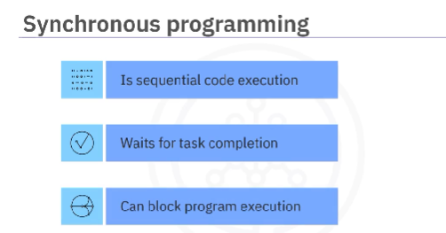
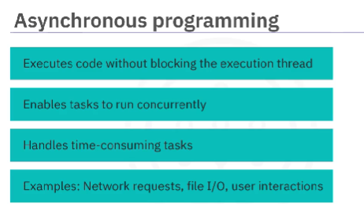
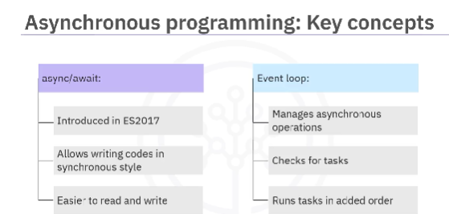
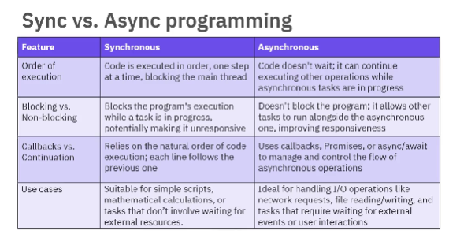

<!-- What is Synchronous JavaScript? -->
In synchronous programming, operations are performed one after the other, in sequence. So, basically each line of code waits for the previous one to finish before proceeding to the next. This means that the program executes in a predictable, linear order, with each task being completed before the next one starts

console.log("Hi");
console.log("Geek");
console.log("How are you?");

What is Asynchronous JavaScript?
Asynchronous programming, on the other hand, allows multiple tasks to run independently of each other. In asynchronous code, a task can be initiated, and while waiting for it to complete, other tasks can proceed. This non-blocking nature helps improve performance and responsiveness, especially in web applications.

Example: In this example, we have shown the Asynchronous nature of JavaScript.

console.log("Hi");

setTimeout(() => {
    console.log("Geek");
}, 2000);

console.log("End");

