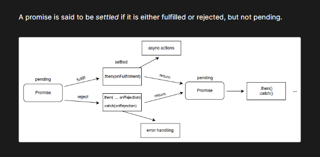

Promises in JavaScript

Introduction

Promises are a key feature in JavaScript, introduced in ES6, to handle asynchronous operations. They allow developers to write cleaner, more readable code when working with tasks such as fetching data from a server, reading files, or performing operations that take time to complete.

Key Concepts

1. What is a Promise?

A Promise is an object that represents the eventual completion or failure of an asynchronous operation. It can have three states:

Pending: The initial state, neither fulfilled nor rejected.

Fulfilled: The operation completed successfully.

Rejected: The operation failed.

Benefits of Promises

Avoid Callback Hell: Promises make code more readable and maintainable.

Chaining: Promises can be chained to handle multiple asynchronous operations in sequence.

Error Handling: Centralized error handling with .catch().

Limitations

Still requires understanding of asynchronous code.

Can be complex when working with large promise chains or nested promises.

Conclusion

Promises simplify asynchronous programming by providing a clean, structured way to handle operations that may complete in the future. Combined with modern features like async/await, they are essential for efficient JavaScript development.

